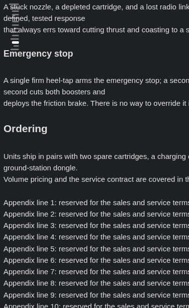
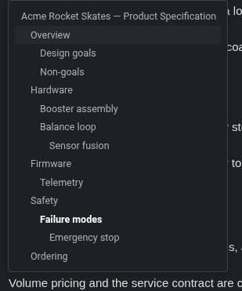
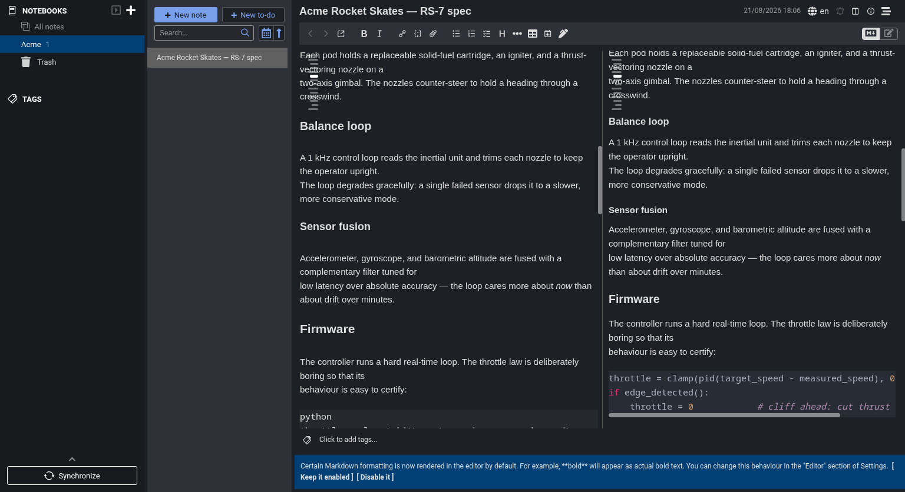

# Ridgeline — a Joplin plugin

A hover-expanding minimap outline for the Markdown editor and the rendered viewer.

Ridgeline draws a compact stack of thin bars down the edge of your note — one bar per heading, its length encoding the heading level — so the shape of a long note is always in view without taking any real space. The bar for the section you are reading is brightened and thickened, and it tracks your scrolling live. Rest the pointer on the bars and the stack expands into a full table of contents, indented by level, with the current heading highlighted; click any bar or row to jump straight to it. It works the same in the raw editor and in the rendered viewer, follows your Joplin theme, and updates instantly when you change its settings — no reload.



*The compact minimap in the editor: one thin bar per heading, length encoding the level, with the current section's bar brightened.*



*Resting the pointer on the bars opens the full outline — rows indented by heading level, the current heading in bold.*



*In a split view the strip tracks the current section in both the editor and the rendered viewer at once.*

## Features

- **Compact level-encoded minimap.** One thin bar per heading; the bar length encodes the heading level (H1 longest … H6 shortest), so the note's structure reads at a glance from a sliver of edge space.
- **Live current-section tracking.** The bar for the section at the top of the viewport is brightened and thickened and follows your scrolling in real time, centred in its slot so it never looks like it dropped toward a neighbour.
- **Hover-intent table of contents.** Let the pointer rest on the bars (a short dwell, so a mouse merely crossing the strip never pops it open) and the stack expands into a full clickable outline, indented by level, with the current heading highlighted. Click a bar or a row to jump.
- **Editor and viewer, in step.** The strip is drawn in both the raw Markdown editor and the rendered note viewer, and a jump from either pane moves both.
- **Overlay or reserve.** Draw the strip over the text, or reserve a thin margin so it never overlaps a word — set independently for the editor and the viewer.
- **Left or right, your call.** Park the strip on either edge of the pane.
- **Theme-aware.** Colours are derived from the live editor surface, so the strip looks right on light, dark, and custom themes with no palette to configure.
- **Live settings and multi-window.** Every setting applies immediately, in every open window, without a reload.
- **Stays out of the way.** Hide the whole strip with a keystroke, or let it disappear automatically on notes that have no headings so the text uses the full width.

## Install

In Joplin, open **Settings → Plugins**, search for **"Ridgeline"**, and click **Install**. Ridgeline is desktop-only (it needs the CodeMirror editor) and requires Joplin 3.3 or newer.

To install the file by hand instead, download `io.github.pmslava.ridgeline.jpl` from the [releases page](https://github.com/pmslava/joplin-plugin-ridgeline/releases) and use **Plugins → Install from file**.

## Settings

All settings live under **Settings → Ridgeline** and apply live.

| Setting | Default | What it does |
| --- | --- | --- |
| **Strip side** | Left | Which edge of the editor/viewer the strip sits on — Left or Right. |
| **Editor strip mode** | Overlay | `Overlay` draws over the text; `Reserve margin` adds a thin margin so text is never covered. |
| **Viewer strip mode** | Overlay | The same choice for the rendered viewer, set independently of the editor. |
| **Maximum heading depth** | H1–H6 | The deepest heading level shown. Headings deeper than this are dropped from the minimap and the outline. |
| **Show minimap** | On | Master switch for the strip in both panes. Toggle without disabling the plugin (see the command below). |
| **Hide minimap when the note has no headings** | On | On a heading-less note, hide the strip and drop its reserved margin so the text uses the full width. |
| **Hover open delay (ms)** | 300 | How long the pointer must rest on the bars before the outline opens (100–1000 ms). Higher = a quick trip across the strip never opens it. |

### Commands and shortcuts

| Command | Shortcut | Also |
| --- | --- | --- |
| **Ridgeline: Toggle minimap** | `Ctrl+Alt+M` | A note-toolbar button (the `fa-stream` icon — a stack of staggered lines that reads as the minimap). |
| **Ridgeline: Toggle strip side (left/right)** | `Ctrl+Alt+R` | — |
| **Ridgeline: Toggle hide-when-empty** | `Ctrl+Alt+H` | — |

All three are also in the **Tools** menu, and each flips the matching setting so both panes update live.

## Development

```
git clone https://github.com/pmslava/joplin-plugin-ridgeline
cd joplin-plugin-ridgeline
npm install
npm run dist
```

`npm run dist` builds the publishable plugin to `publish/io.github.pmslava.ridgeline.jpl`.

For the end-to-end test suite, regenerating the showcase screenshots, and a tour of the repository layout, see [DEVELOPMENT.md](DEVELOPMENT.md). See [PUBLISHING.md](PUBLISHING.md) for the release flow.

## Credits

Ridgeline's click-to-jump machinery — firing `scrollToHash` for the rendered viewer and an editor scroll command for the raw Markdown pane so a jump from either surface keeps both in step — follows the approach in [cqroot/joplin-outline](https://github.com/cqroot/joplin-outline) (MIT).

## License

MIT. See [LICENSE](LICENSE).
